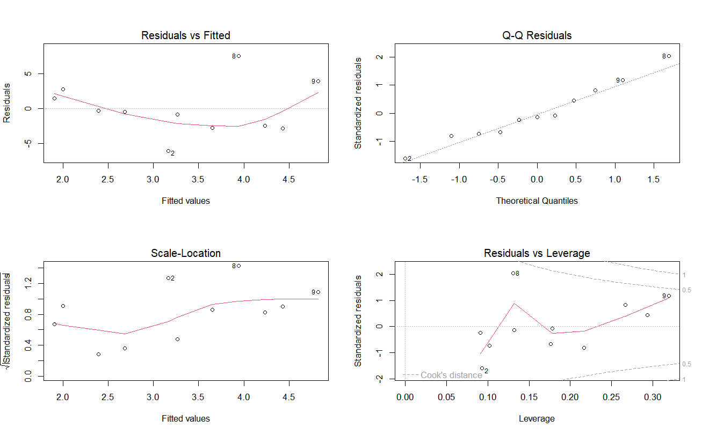

# CPI–WPI Regression Analysis using R

## Overview
This project analyzes the relationship between the Consumer Price Index (CPI) and the Wholesale Price Index using linear regression in R.

## Objectives
- Clean and prepare the dataset.
- Perform regression analysis.
- Visualize the results.
- Interpret the statistical findings.

## Tools Used
- R Programming
- Microsoft Excel

## Files
- Dataset_CPI_WPI.xlsx
- Regression_Analysis_CPI_WPI.R
- Regression_Analysis_Report.pdf

## Visualizations

### Scatter Plot

### Diagnostic Plots

## Skills Demonstrated
- Data Cleaning
- Regression Analysis
- Statistical Analysis
- Data Visualization
